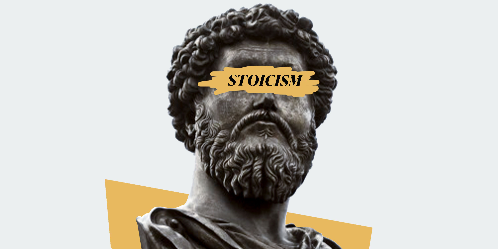

# Applied Data Science @ Columbia
## Spring 2023
## Project 1: A "data story" on the history of philosophy




### [Project Description](doc/)
This is the first and only *individual* (as opposed to *team*) project this semester. 

Term: Spring 2023

+ Projec title: Lorem ipsum dolor sit amet
+ This project is conducted by Yi Sun

+ Project summary: There are two parts in my report. The first contains the general exploratory data analysis with some graphics on the length, amount of sentences, and sentiment. The second part focus on Stoicism. Analyzed the two dominant periods and some significant words. Finnally, thank you for reading!

Following [suggestions](http://nicercode.github.io/blog/2013-04-05-projects/) by [RICH FITZJOHN](http://nicercode.github.io/about/#Team) (@richfitz). This folder is orgarnized as follows.

```
proj/
├── lib/
├── data/
├── doc/
├── figs/
└── output/
```

Please see each subfolder for a README file.
